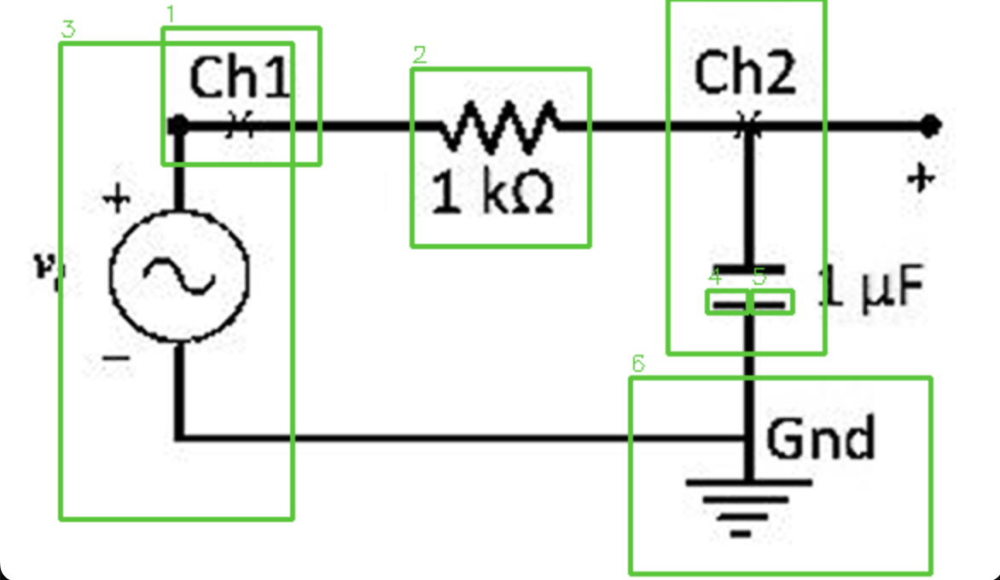
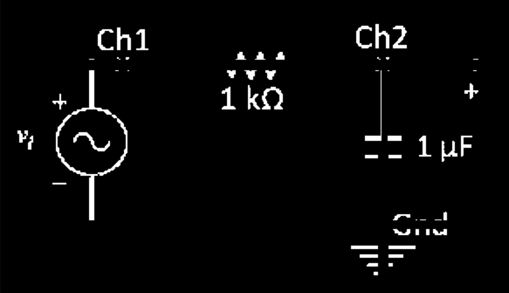
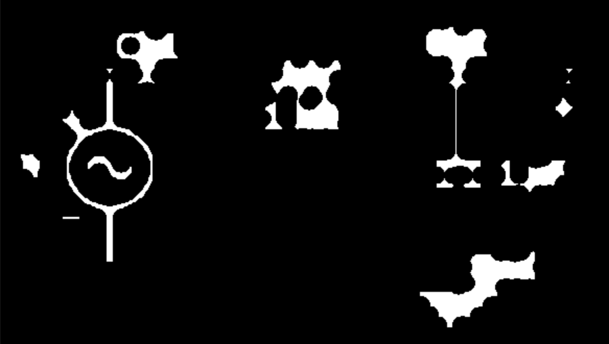
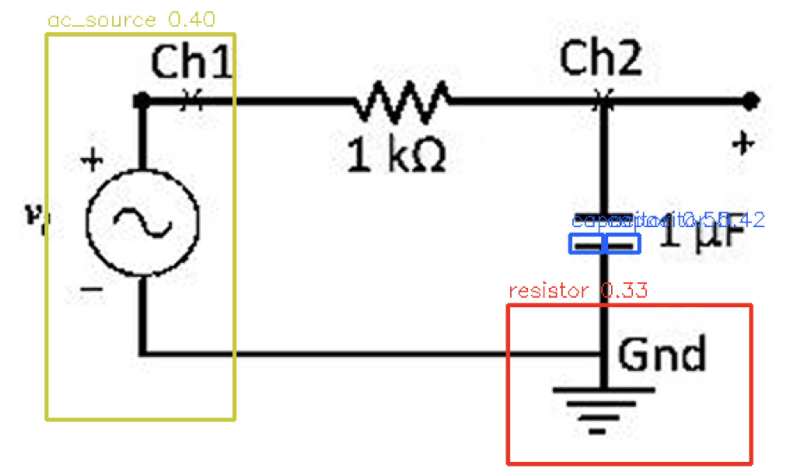
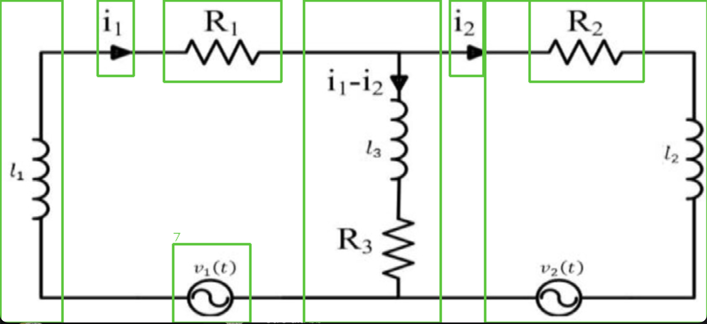
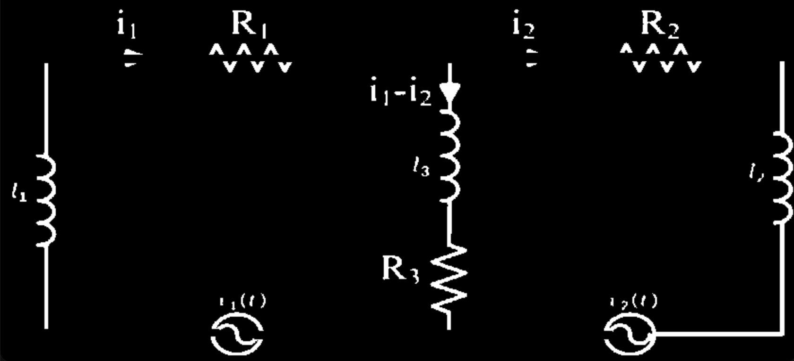
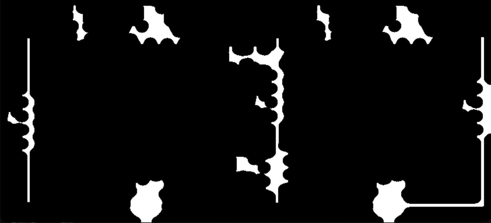
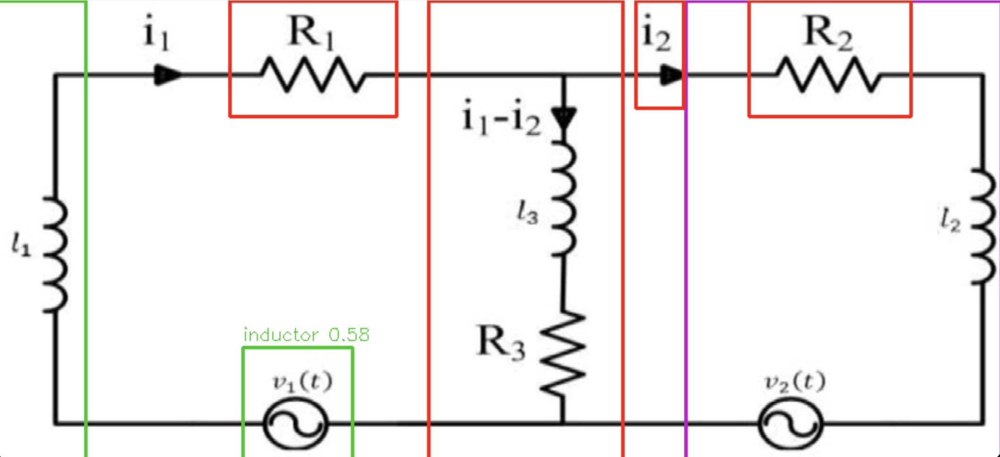
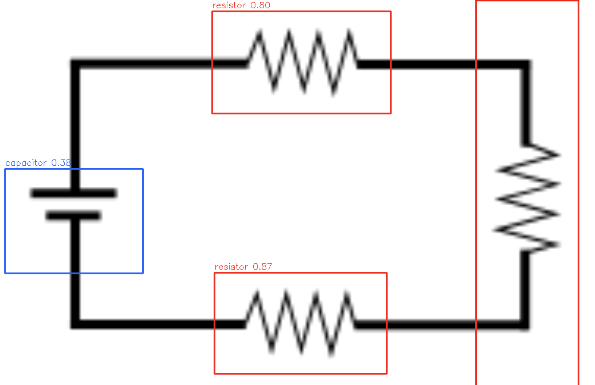
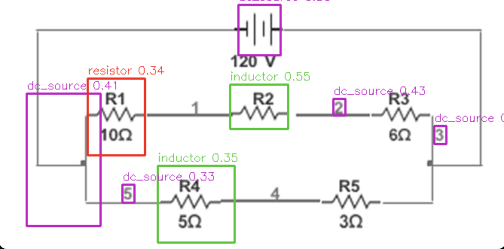

# Circuit Symbol Detector

A computer vision pipeline that detects and classifies electrical circuit symbols in schematic images. Built with OpenCV and scikit-learn - no deep learning, just classical CV.

**Detects:** resistors, inductors, capacitors, DC sources, AC sources

---

## Setup

```bash
python3 -m venv venv
source venv/bin/activate
pip install -r requirements.txt
```

---

## How it works

```
image → preprocess → detect candidates → classify → results
```

**Preprocessing** converts the raw image to a clean binary: grayscale conversion, upscaling if the image is small (under 800px), Otsu thresholding to separate strokes from background, and small blob removal to clean up noise.

**Detection** finds candidate regions by erasing wires first (Probabilistic Hough Transform on horizontal and vertical segments), then running Connected Component Analysis on what remains. Blobs are filtered by size, aspect ratio, and proximity to erased wires. Each surviving blob is cropped with padding and passed to the classifier.

**Classification** extracts HOG features from each crop (resize to 64×64 preserving aspect ratio → CLAHE contrast normalization → centroid centering → HOG) and runs them through an RBF SVM. Predictions below a confidence threshold or classified as garbage are discarded. Non-Maximum Suppression removes overlapping detections.

**Augmentation** expands the training set by applying rotations, flips, shears, elastic distortions, perspective warps, stroke width changes, noise, and brightness variation (in single and chained combinations) distributed evenly across original examples up to a configurable target count per class.

**Synthetic data generation** draws each symbol programmatically from its geometric definition (zigzag for resistor, stacked ellipses for inductor, parallel lines for capacitor, etc.) with random stroke width variation and realistic background noise (wire stubs, text fragments, junction dots) to simulate what real detection crops look like.

---

## Usage

### 1. Debug preprocessing steps on one image
```bash
python main.py --mode debug_preprocess --image ./path_to_image
python main.py --mode debug_preprocess --image ./data/electrical_95_png.rf.39a4a800377fa1419dc79d9c4df4cd78.jpg
```
Shows each preprocessing step in sequence: grayscale → upscale → Otsu threshold → noise cleanup. Press any key to advance, `q` to quit early.

### 2. Debug detection steps on one image
```bash
python main.py --mode debug_detect --image ./path_to_image
# usage example
python main.py --mode debug_detect --image ./data/electrical_95_png.rf.39a4a800377fa1419dc79d9c4df4cd78.jpg
```
Shows: wire mask → binary after wire removal → after fragment merge → wire proximity mask → final candidates with bounding boxes.

### 3. Label candidates for training
```bash
python main.py --mode label --images_dir ./images_folder
# usage example
python main.py --mode label --images_dir ./data
```
Runs detection on all images in the folder and opens the interactive labeling tool. Keys: `c`=capacitor, `i`=inductor, `r`=resistor, `d`=dc_source, `a`=ac_source, `g`=garbage, `s`=skip, `q`=quit.

**Labeling guidelines:**
- Label a symbol only if you can identify it confidently from the crop alone
- Label fragments, junction dots, text, and arrows as `g` (garbage)
- Skip merged crops where two symbols are joined together
- Skip crops where text takes up more than a third of the area

### 4. Generate synthetic training images
```bash
python main.py --mode synthetic
# delete existing synthetic files
rm labeled_data/*/syn_*.png
```
Generates 30 programmatically drawn examples per class with random stroke width and background noise. Synthetic files are named `syn_XXXX.png` and treated as originals (included in the validation test set).

### 5. Augment the labeled data
```bash
python main.py --mode augment
# delete existing augmented files
rm labeled_data/*/aug_*.png
```
Expands each class up to 60 examples using chained transforms. Augmented files are named `aug_XXXX.png` and always stay in the training set.

### 6. Train the classifier
```bash
python main.py --mode train
```
Loads all labeled data, extracts HOG features, trains an RBF SVM, and prints a validation report on original examples only. Saves the model to `model.pkl`.

### 7. Run detection
```bash
python main.py --mode run --image ./path_to_image
python main.py --mode run --image ./path_to_image --debug
# usage example
python main.py --mode run --image ./test_images/og.jpg --debug
```
`--debug` shows the binary after wire removal and the detected candidates before classification. 
The final result window shows colored bounding boxes per class: resistor=red, inductor=green, capacitor=blue, dc_source=magenta, ac_source=cyan.

---

## Dataset and training

19 circuit schematic images were used for labeling. The detection pipeline extracted ~116 candidate regions per run, of which roughly 94 were labeled across 6 classes.

| Class | Originals | Synthetic | Augmented | Total |
|---|---|---|---|---|
| garbage | 22 | - | +22 | 44 |
| resistor | 24 | 30 | +6 | 60 |
| inductor | 18 | 30 | +12 | 60 |
| capacitor | 9 | 30 | +21 | 60 |
| dc_source | 6 | 30 | +24 | 60 |
| ac_source | 3 | 30 | +27 | 60 |

### Validation report (originals only)

| Class | Precision | Recall | F1-score | Support |
|---|---|---|---|---|
| ac_source | 1.00 | 0.86 | 0.92 | 7 |
| capacitor | 1.00 | 0.88 | 0.93 | 8 |
| dc_source | 0.58 | 1.00 | 0.74 | 7 |
| garbage | 1.00 | 0.50 | 0.67 | 4 |
| inductor | 0.90 | 0.90 | 0.90 | 10 |
| resistor | 0.80 | 0.73 | 0.76 | 11 |
| **accuracy** | | | **0.83** | **47** |

The train/test split is done on original examples only; augmented and synthetic files always stay in the training set to prevent leakage. Support counts of 7–11 per class are too small for these numbers to be statistically precise; the main takeaway is that resistors and inductors are the best-learned classes, which tracks with them having the most real labeled examples.

---

## Results

### og.jpg - reference image from the training dataset

 

This is the reference test image, a simple circuit with one AC source, one resistor, and one capacitor. It contains the kinds of symbols that appear most in the training data, which makes it useful for understanding where the pipeline succeeds and where it breaks down.

Looking at the detection step, the binary after wire removal (og_no_wires.png) shows the AC source circle cleanly isolated with its lead wires still attached, the resistor zigzag fragmented into separate peaks by wire erasure, and the capacitor split into its two individual plates. 
After fragment merge (og_fragment_merge.png), some of the fragmented components reconnect into a single blob but at a cost, the closing operation that bridges the gaps also absorbs nearby text and noise, distorting the shape. The resistor is the clearest example: its zigzag peaks reconnect but merge with the '1 kΩ' label sitting above, producing a blob that no longer looks like a zigzag.




The final result detects the AC source correctly (0.40 confidence) despite the noisy crop, the circle with sine wave is dominant enough that HOG still recognizes it. Both capacitor plates are detected correctly (0.55 and 0.42). The resistor however is missed. The "Gnd" ground symbol and text at the bottom gets a false positive as resistor (0.33), this was a symbol not in the training set that the model doesn't know how to reject.


---

### test4.png - complex circuit from the internet



This is a more complex circuit with 3 resistors (R1, R2, R3), 3 inductors (l1, l2, l3), and 2 AC sources (v1(t), v2(t)). It's a good stress test because it has many symbols of the same type at different orientations and scales.

The detection step (`test_4_no_wires.png`) shows the pipeline handling the wire erasure well; the horizontal and vertical wires are mostly removed, leaving the symbols as isolated blobs. After fragment merge (`test_4_fragment_merge.png`), the inductors on the left and right (l1 and l2) stay connected to the outer frame wire because those vertical wires weren't fully erased. This causes them to be detected as large blobs spanning the full image height rather than clean inductor crops.




The final classification detects R1 correctly as a resistor (0.53) and v1(t) is detected as an inductor (0.58), the AC source circle with its coil-like sine wave is being confused with an inductor, which is a known failure mode. The large blobs for l1 and l2 span y=0 to the full image height, which means they're classified against crops that are essentially the entire left or right side of the image, making reliable classification impossible. R3 and v2(t) are missed entirely, they were either filtered out by the near-wire filter or fell below the confidence threshold.

This image illustrates the core detection problem clearly: when wire erasure is incomplete, symbols stay connected to wires and surrounding elements, and the resulting blobs are too large and too mixed to classify correctly.


---

### test5.png - clean digital schematic



This is a clean circuit with a DC source (battery symbol on the left), two horizontal resistors (top and bottom), and one vertical resistor on the right. The clean line quality and separation between elements makes wire erasure more reliable here than on other images.

The two horizontal resistors are correctly detected at 0.87 and 0.80, the highest confidence scores across all test images, reflecting that this resistor style is well represented in the training data. The DC source on the left is misclassified as capacitor (0.38), this is the most persistent failure in the pipeline. Both symbols consist of parallel horizontal lines and produce very similar HOG feature vectors. With only 6 real DC source training examples, the model cannot reliably distinguish them. The vertical resistor on the right has a bounding box that spans the full image height, which is a detection artifact rather than a clean symbol crop.

---

### test6.png - circuit with multiple symbol types



This circuit has a DC source (120V battery), multiple resistors, and inductors.

The DC source at the top is correctly identified (0.48), which is one of the better dc_source results across all test images. Two resistors in the circuit are correctly detected (0.34). However several tiny junction arrow crops (16×22px and 16×24px bounding boxes) are being classified as dc_source; these are current direction indicators, not actual sources, but they look like short parallel lines to HOG which resembles the dc_source training examples. R2 is classified as inductor (0.55) rather than resistor, likely because its crop includes surrounding wire context that makes the zigzag look like a coil pattern.

---

## Known limitations and failure modes

**Detection failures** - the per-direction Hough percentile threshold (`WIRE_PERCENTILE_FOR_MIN_LENGTH = 15`) prevents short symbol edges from being erased as wires but also sometimes leaves real wire segments unerased, causing symbols to stay connected to surrounding text and wire context. Fragment merge (`FRAGMENT_MERGE_STROKE_MULTIPLIER = 2`) can absorb text labels into symbol blobs, producing crops that the classifier cannot recognize. Symbols not connected to any erased wire (circles, isolated components) are dropped by the near-wire proximity filter.

**Classification failures** - DC sources and capacitors are nearly identical under HOG (both consist of parallel lines) and with only 6 real DC source originals the model cannot reliably distinguish them. AC sources had only 3 real originals and are sometimes confused with inductors when the sine wave inside the circle resembles coil arcs. Any symbol outside the 5 target classes (diodes, transistors, ground symbols, switches) gets misclassified as the nearest-looking known class.

---

## What would actually improve results

**More real labeled originals** is the single highest-leverage change. Augmentation and synthetic data help, but they cannot substitute for diversity in the original examples. Targeting ac_source and dc_source specifically would close the biggest gaps.

**Better preprocessing to separate labels from symbols** - one of the most consistent failure modes is text labels ("1 kΩ", "R1", "Ch1") merging with their symbol through the fragment merge step, producing crops that are half symbol and half text. A dedicated text removal step before detection would give the classifier much cleaner crops to work with.

**Circuit topology constraints as a post-processing layer** - the classifier currently treats each candidate independently, with no knowledge of circuit rules. Adding a logic layer on top of the raw detections that enforces known circuit constraints would filter out many false positives. For example, a valid circuit must have at least one source (AC or DC); if none are detected, the lowest-confidence source candidate should be promoted rather than discarded. Similarly, certain symbol combinations are implausible, two DC sources side by side with no connecting elements is unlikely, and overlapping detections of the same class at different scales usually mean one is a false positive. This kind of rule-based post-processing is cheap to implement and could meaningfully reduce the false positive rate without retraining.

**Synthetic data quality** - making synthetic drawings more closely match the drawing style of the target dataset (stroke thickness, symbol proportions, presence of label text) would reduce the domain gap between synthetic training images and real inference crops.


